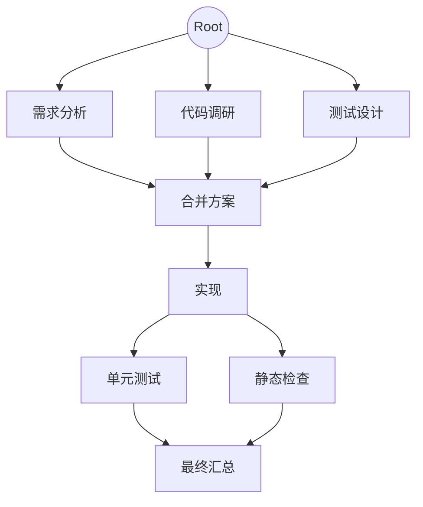

# GraphJob 多 Subagent 任务图需求分析与方案（评审稿）

> 状态：第二轮需求确认，14 项产品决策已固化，等待整体方案评审
> 日期：2026-08-31
> 建议插件名：`@p-dsh-market/graph-job-orchestrator`
> 建议入口：`/graphjob`

## 1. 结论先行

这个功能不宜直接做成 `subagent-codex` 的一个“大功能开关”，而应新增一个独立的 **Graph Job 编排插件**：

- `subagent-codex`、DSH 进程内 Agent 等只负责“执行一个节点”；
- Graph Job 插件负责 Agent 配置、自动规划、手工画图、DAG 校验、并发调度、汇合屏障、运行状态、版本修订和持久化；
- 当前对话模型是协调者，只能在用户允许的 Agent、模型、工具和非插件 Skill 清单内生成或修订图；
- 所有模型生成的 Graph 都必须先经过宿主侧 Schema、权限和 DAG 校验，不能让模型直接写配置文件或任意启动执行器；
- 一个普通对话只绑定一个活动 Graph，但 Graph 内部保留 revision 和 run 记录；手工模板按 `workspace` 或 `global` 范围复用，不等于当前对话的活动 Graph；
- 每个无前驱任务节点可并行，任意节点都必须等待全部前驱成功后才能运行，因此“合并节点等待所有分支”是调度器的基础语义，而不是仅靠 Prompt 约定。
- 自动生成或修订的 Graph 必须先预览并由用户确认，确认前不得执行任何节点。

整体可行，但不是纯前端插件工作。当前本机托管 Runtime 为 `0.1.1-rc.2`，已有进程内 subagent seam、Agent 创建、工具限制和 `conversation.view` 等基础能力；不过要完整满足本需求，至少有两处能力缺口需要补齐：

1. 参考的 `dsh-subagent-codex` 当前只支持由 Profile 静态指定可选 `model`，不支持按一次节点运行动态指定推理强度，也明确拒绝 `agentOptions`、工具过滤、persona 等共享能力。Graph Job 不要求普通 Provider 设置推理强度；Codex 也只在执行器明确报告支持时显示和保存该字段。
2. 现有通用 subagent seam 支持 `toolFilter`，但没有 `skillFilter`。MCP 在 DSH 中最终表现为 Tool，可以过滤；Skill 是独立注册表。本需求明确禁止子 Agent 使用任何插件提供的 Skills，因此需要按 Skill source/provider 做权威分类和过滤。

允许升级托管 Runtime。建议把项目拆成“Graph Job 市场插件”与“必要的 Runtime 能力增强”两条交付线，不在市场插件内部复制一套 Codex app-server 客户端，也不为了推理强度单独维护 Codex 私有分支。

## 2. 参考实现给出的边界

参考文档：[`@deepseek-ai/dsh-subagent-codex` 中文说明](https://github.com/deepseek-ai/deepseek-harness/blob/master/packages/subagent/subagent-codex/README.zh.md)。

该提供方适合作为 Codex 类型节点的执行后端，当前主要特征是：

- 每次运行创建全新的 Codex app-server 进程、临时线程和单一轮次；
- 子级工作目录来自父会话，Codex 原生配置和身份认证仍是权威来源；
- 可由 Profile 静态指定提供方名称、模型和无人值守权限模式；
- 前台返回最终答案，后台返回 Job id，过程推理、工具活动、stderr 和工作区差异不复制回父会话；
- 当前不支持续接、恢复、池化、进度流、工具过滤、persona、output schema 和动态 `agentOptions`；
- 已产生的文件或外部副作用不会在取消或失败时自动回滚。

由此得到三个设计约束：

1. Graph 节点输出必须以“最终结果 + 状态 + 安全诊断”为稳定合同，不能依赖 Codex 的中间 reasoning。
2. Graph 的暂停、重试、恢复、并行和依赖关系必须由 Graph Job 自己持久化，不能依赖 Codex 临时线程。
3. 并行写同一工作区存在冲突风险，必须单独定义写入隔离策略。

模型名不能写死。普通 Provider 只选择 Provider 和 Model，不提供 Graph Job 级推理强度设置；Codex 仅在已安装执行器明确公布支持时显示 reasoning effort，并从当前 Runtime 动态获取和校验可选项。参考：[OpenAI Model guidance](https://developers.openai.com/api/docs/guides/latest-model)。

## 3. 需求术语建议

为避免“Agent、节点、任务、Graph”混用，建议统一为以下对象：

| 对象 | 含义 |
|---|---|
| Agent Profile | 用户配置的可复用执行角色，包含执行器、模型、Prompt、能力范围，以及 Codex 可选推理强度 |
| Graph Template | 可重复选择的手工任务图模板，不绑定具体对话或某次运行 |
| Graph Instance | 某个对话当前绑定的任务图，来源可以是自动生成、手工新建或模板快照 |
| Graph Revision | Graph Instance 或 Template 的一次不可变版本 |
| Graph Run | 针对某个 revision 的一次实际执行 |
| Task Node | 由某个 Agent Profile 执行的任务节点 |
| Merge Node | 收集全部前驱结果并综合的任务节点，本质上仍是“等待全部前驱”的 Task Node |
| Virtual Root | 只保存用户总目标的虚拟根，不消耗一次 Agent 运行 |

“起始自动创建 Subagent”确定为：在 Graph 建立时创建并冻结 **Agent Profile 快照**，节点进入 ready 状态时才真正创建进程/Session。这样既满足配置从起始就确定，也避免还未执行的节点长期占用资源。

## 4. 对现有 8 项要求的映射

| 原要求 | 方案映射 | 当前判断 |
|---|---|---|
| 1. 自有模型与 Codex 组成，可选模型；Codex 支持时可选推理强度；自有模型可选 MCP/Tools/Skills | Agent Profile + 两类 Executor；能力清单由宿主发现并冻结到 revision；过滤全部插件 Skills | 模型/工具可行；Codex 推理强度按能力显示；Skill 分类过滤需补能力 |
| 2. 起始自动创建，未指定则继承对话默认模型 | 建图时解析并快照默认 Provider、Model，不保存“空值继承” | 已确认；运行中不随全局默认变化 |
| 3. 自动模式由大模型指派 | 主对话协调模型接收目标和允许的 Agent roster，输出受限 Graph JSON / patch | 可行；必须宿主校验 |
| 4. 手工拖拽形成任务图并长期复用 | `conversation.view` 图编辑器 + 固定用户插件数据目录中的模板库 | 已确认 |
| 5. `/graphjob` 唤起 | 注册 DSH command，并把本轮标记为 Graph Job 上下文 | 可行；可复用 `/vision` 的命令注册方式 |
| 6. 像地图插件一样新增页面 | 注册 `conversation.view`，可补充会话 header action 和节点结果卡片 | 可行；可复用 `amap-map-assistant` 页面方式 |
| 7. 每对话一张图、支持模型修正、手工图切换不可回退 | Session Binding + revision 状态机 + manual lock + 模板保存决策 | 已确认保留只读审计历史，但 UI 不可回退 |
| 8. 根节点开始、分支并行、汇合等待全部完成 | 拓扑调度器 + 并发池 + all-predecessors barrier | 已确认；失败暂停整图，只允许重试或终止 |

## 5. 建议的用户流程

### 5.1 自动模式

1. 用户先在 Graph Job 页面配置或选择 Agent Profiles。
2. 用户输入 `/graphjob <总目标>`，或者在 Graph Job 页面选择“自动生成”。
3. 插件冻结当前对话模型、Agent roster、可用工具/非插件 Skill 清单和权限策略。
4. 当前对话模型只基于这份清单产生 Graph Draft；v1 不提供单独的 Planner 模型覆盖项。
5. 宿主执行以下校验：
   - JSON Schema；
   - Agent Profile 是否存在；
   - 节点、边是否引用有效 ID；
   - 是否存在环；
   - 节点数、深度、并发度和输出预算是否越界；
   - 节点要求的 Tool / Skill 是否在其允许清单内；
   - 是否出现禁止的 Graph Job 自调用能力。
6. 在 Graph 页面显示预览、校验结果和预计并行层级。
7. 用户确认后创建 Graph Run；确认是强制步骤，不能配置为自动跳过。
8. 执行中，主对话可以提出修改，但只允许修改尚未开始的节点；涉及 running / completed 节点时创建新 revision 和新 run。

### 5.2 手工模式

1. 用户新建空 Graph 或从模板库选择。
2. 在画布中拖入 Task Node、Merge Node，连接有向边。
3. 右侧属性栏设置任务说明、Agent Profile、输入映射、重试和失败策略。
4. 编辑时即时检查环、悬空边、缺少 Agent、不可用模型/工具等问题。
5. 保存为模板，或仅绑定当前对话。
6. 一旦当前对话从自动图切换到手工图，写入 `manualLock=true`；产品 UI 不再提供回到先前自动图的操作。
7. 主模型修改手工图时只生成候选 revision；用户必须选择：
   - “另存为新模板”；
   - “覆盖当前模板的最新版本”。

“覆盖”只更新模板的 current revision 指针，历史 revision 仍保留审计；产品 UI 不提供回到旧自动图或旧手工 revision 的操作。物理删除历史不属于覆盖流程。

## 6. 总体架构

```mermaid
flowchart LR
    U[用户 / 主对话] --> C[/graphjob 与 Graph 页面]
    C --> P[Graph Planner / Revision Engine]
    P --> V[Schema + 权限 + DAG 校验器]
    V --> S[Graph Scheduler]
    S --> E1[DSH In-process Executor]
    S --> E2[Codex Executor]
    E1 --> R[Node Result Store]
    E2 --> R
    R --> S
    S --> UI[状态流 / Graph 页面]
    V --> DB[模板、revision、run、事件日志]
    S --> DB
```

建议分为六个内部模块：

| 模块 | 职责 |
|---|---|
| Capability Catalog | 发现 Provider、Model、Codex 可选 Reasoning、Tools、MCP Tools、非插件 Skills 和 Subagent Provider |
| Planner / Revision Engine | 自动生成完整 Graph，或基于自然语言生成受限 patch |
| Graph Validator | Schema、环检测、依赖、能力、预算和权限校验 |
| Scheduler | ready 队列、并发池、barrier、取消、重试和恢复 |
| Executors | 将统一节点请求适配为 DSH 进程内 Agent 或 Codex one-shot |
| Storage + Event Stream | 原子保存 revision，追加 run 事件，通过 SSE 向页面推送状态 |

## 7. Agent Profile 设计

建议的逻辑结构如下，字段名只是评审草案：

```json
{
  "id": "coder-sol",
  "name": "Codex 实现 Agent",
  "executor": "codex",
  "provider": "codex",
  "model": "gpt-5.6-sol",
  "reasoningEffort": "high",
  "persona": "负责实现指定模块并给出验证结果",
  "capabilities": {
    "tools": [],
    "skills": []
  },
  "permissionMode": "approve-for-me",
  "maxOutputTokens": 12000
}
```

### 7.1 DSH 进程内 Agent

- 未指定 Provider / Model 时，在 Graph revision 创建时继承当前对话默认选择并写成明确值。
- 普通 Provider 不提供 Graph Job 级 `reasoningEffort` 配置项。
- MCP 已注册为 `mcp__<server>__<tool>` 工具，和普通 Tool 一起走 Tool allowlist。
- 子 Agent 默认继承父 Agent Preset，再执行收窄，不能比父 Agent 获得更多能力。
- 必须 deny Graph Job 的创建、修订、执行和模板管理工具，防止子 Agent 递归修改自己的调度图。
- 所有插件提供的 Skills 都不得出现在子 Agent 的 Skill 目录中，也不得被 `skill` Tool 加载。用户只能从非插件来源的已安装 Skills 中选择 allowlist。

### 7.2 Codex Agent

- 通过正式 `subagent-codex` provider / app-server 路径运行，不在插件内 shell 调用宿主 Codex CLI。
- v1 按节点 one-shot；不承诺跨节点记忆或进度流。
- Codex 的 MCP、Skills、审批和 sandbox 仍由 Codex 原生配置与 Profile 权限模式决定；Graph Job 只选择经过用户批准的 Codex Agent Profile。
- `reasoningEffort` 是 Codex 专属可选字段：只有当前 Codex provider / app-server 明确报告支持时才显示和保存；不支持时省略该字段，不做模拟或静默替换。

### 7.3 模型与 Codex 可选推理强度发现

- UI 先选择执行器和 Provider，再动态列出该 Provider 的模型。
- 普通 Provider 选定模型后结束配置，不显示 reasoning effort。
- Codex 选择模型后，仅在执行器公布支持时显示它的 reasoning effort；不支持的值不允许保存。
- 旧模板加载时如果模型已下线，应标记 `capability-mismatch`，不能静默改成新模型。
- “继承默认”只在创建 revision 时解析一次，运行中修改全局默认不影响已经冻结的图。

示例中的 `reasoningEffort` 因 `executor` 为 `codex` 才可能出现；它不是 Agent Profile 的通用必填字段。

## 8. Graph 数据与版本语义

建议每个 Graph revision 至少包含：

```json
{
  "schemaVersion": 1,
  "graphId": "graph-...",
  "revision": 3,
  "source": "auto",
  "manualLock": false,
  "goal": "实现并验证某功能",
  "agentProfiles": [],
  "nodes": [
    {
      "id": "implement",
      "kind": "task",
      "title": "实现功能",
      "instruction": "...",
      "agentProfileId": "coder-sol",
      "access": "write",
      "outputContract": {
        "text": true,
        "artifactRefs": true
      },
      "failurePolicy": "pause"
    }
  ],
  "edges": [
    { "from": "root", "to": "implement" }
  ],
  "limits": {
    "maxParallel": 4,
    "maxNodes": 32,
    "maxDepth": 8
  }
}
```

模型修订不应提交整个文件覆盖，而应生成受限 patch，例如：

```json
{
  "baseRevision": 3,
  "operations": [
    { "op": "addNode", "node": {} },
    { "op": "addEdge", "from": "test-unit", "to": "merge" },
    { "op": "updateNode", "nodeId": "implement", "changes": {} }
  ]
}
```

宿主应用 patch 后重新做全量校验，成功才产生 revision 4。这样可以防止模型漏掉未修改节点，也方便页面展示变更差异。

## 9. DAG 调度语义

### 9.1 节点状态

```text
pending -> ready -> running -> succeeded
                    |-------> failed
                    |-------> cancelled
pending --------------------> blocked
```

- `ready`：全部前驱满足依赖，且并发槽可用。
- `running`：执行器已经发布节点运行。
- `succeeded`：收到符合节点输出合同的最终结果。
- `failed`：执行器失败、超时、输出无效或重试耗尽。
- `blocked`：前驱失败后等待整图处理；它不是跳过，只有前驱重试成功后才能重新进入 `ready`，或在用户终止整图时转为 `cancelled`。

### 9.2 并行与汇合

- 图中使用一个不执行模型的 Virtual Root 表示总目标。
- 所有入度为 0 的实际任务都视为依赖 Virtual Root，可同时进入 ready。
- 任意节点都采用 all-predecessors barrier；只有所有前驱成功才进入 ready。
- Merge Node 接收所有前驱的最终 `text` 和 `artifactRefs[]`，按稳定的 edge 顺序合并上下文，避免并发完成顺序影响结果。
- 并发受 Graph 全局 `maxParallel`、Executor 上限和 Provider 限流共同约束。



### 9.3 上下游输入

下游节点默认收到：

- Graph 总目标；
- 自身 instruction；
- 直接前驱的最终 `text` 和 `artifactRefs[]`；
- 必要的工作区和权限说明；
- 明确的输出格式与完成标准。

节点 Prompt 必须明确要求返回 `text` 和可选 `artifactRefs[]`。不传递前驱 reasoning / thinking、完整工具轨迹或 stderr；Merge 只合并所有直接前驱的最终正文和 artifact 引用。结果过长时应写入当前对话工作路径下的文件，并传递摘要 + 引用，避免合并节点上下文失控。

`artifactRefs[]` 使用当前对话 `cwd` 下的工作区相对路径。宿主必须解析并验证路径仍位于该 `cwd` 内，可附带文件类型、摘要和生成节点 ID；不能用 artifact 引用访问工作区外文件。下游节点可以按自身 Tool 权限读取这些文件。

### 9.4 并行写入

Codex 文档明确说明取消不会回滚副作用；多个节点共享父工作区时，并行编辑相同文件会相互覆盖。因此 v1 固定采用以下规则：

- `access=read` 的节点可并行；
- `access=write` 的节点默认串行；
- v1 不提供通过 `ownershipPaths` 放开写并行的例外；
- Git worktree / 独立工作目录隔离和自动合并作为后续增强。

### 9.5 失败与重试

- 任一节点任务失败、Schema 失败或权限失败时，立即暂停整张 Graph。
- 用户只能选择“重试失败节点”或“终止整图”，第一阶段不提供“跳过节点”或“用部分结果继续”。
- 只对明确分类为 transport / rate-limit 的错误执行有界自动重试；重试次数和退避策略由 Graph 限制配置固定。
- Merge 始终采用 `all-success`，不会接收失败分支的部分结果。

## 10. 一对话一张 Graph 与修订规则

“只能保持一张 Graph”实现为一个强绑定：

```text
sessionId -> activeGraphId -> activeRevision -> optional activeRunId
```

- 同一 session 同时最多一个 `activeRunId`。
- 自动图可被模型或人工修订，产生同一 `graphId` 的新 revision。
- 切换为手工模板时，模板先快照为当前会话的 Graph Instance，不直接引用可变模板文件。
- 切换成功后 `manualLock=true`，不允许把 active 指针改回之前的自动 revision。
- 为审计保留旧 revision，但 UI 不提供回退入口。这与“不可回退”不冲突，也避免数据不可恢复。
- 已完成的旧 run 保留为历史记录，但不会成为第二张活动 Graph。

运行中修订采用以下规则：

| 被修改对象 | 行为 |
|---|---|
| pending 节点或其边 | 可产生新 revision；当前 run 暂停后由用户确认是否续跑新 revision |
| running 节点 | 不能原地改；可取消后创建新 run |
| succeeded / failed 节点 | 不能改写历史；修改后必须创建新 run |
| 手工模板 | 用户选择另存或覆盖 current revision 指针 |

## 11. 持久化位置

禁止把用户模板写入 `market/graph-job-orchestrator/` 或安装后的 `node_modules` 包目录：这些目录可能只读，也会在升级/重装时被替换。

持久化目录固定为：

```text
%LOCALAPPDATA%/dsh-desktop/plugin-data/graph-job-orchestrator/
  agent-profiles.json
  templates/
    <templateId>/manifest.json
    <templateId>/revisions/<revision>.json
  graphs/
    <graphId>/manifest.json
    <graphId>/revisions/<revision>.json
    <graphId>/runs/<runId>.json
    <graphId>/runs/<runId>.events.jsonl
  session-bindings.json
```

要求：

- 配置和 revision 使用临时文件 + rename 原子写入；
- run 事件使用追加日志，启动时可从最后一个一致 checkpoint 恢复；
- 不保存 API Key、Codex token 或 MCP 密钥；
- 完整子 Agent 对话仍以 Session 为真源，Graph 只保存 child session id、最终结果投影和 artifact 引用；
- 所有 JSON 带 `schemaVersion`，模板导入时做迁移或明确拒绝。

## 12. 页面与交互草案

复用 `amap-map-assistant` 的 `conversation.view` 方式，新增“任务图”页：

- 顶部：Graph 名称、来源、revision、run 状态、自动/手工标记、校验状态；
- 左侧：Agent Profile 和节点类型面板；
- 中间：固定视口画布，支持平移、缩放、拖拽、连线、自动布局；
- 右侧：选中节点或 Agent 的属性编辑器；
- 底部或侧栏：运行时间线、节点输出、失败原因、重试/取消操作；
- 节点颜色表达状态，不用颜色作为唯一状态提示；
- 连线时即时阻止自环和明显成环，保存时仍做权威全图校验；
- 合并节点显示 `已完成前驱数 / 总前驱数`；
- 自动修订显示 diff，用户确认后才应用。

`/graphjob` 建议支持：

```text
/graphjob 实现登录功能并完成测试
/graphjob                  # 打开当前对话的 Graph 页面或新建空草案
```

第一版不建议增加复杂命令参数；模型、Agent 和执行策略在页面里配置，避免命令语法成为第二套配置系统。

## 13. 安全与权限原则

- Planner 只能引用用户已保存且当前可用的 Agent Profile ID。
- Planner 不能自行扩大 Tool、MCP、Skill、sandbox 或 permissionMode。
- 子 Agent 禁止使用任何插件提供的 Skills，并默认禁止 Graph Job 管理工具，不能递归创建或改写图。
- Skill Catalog 必须保留可审计的 source/provider 身份；无法确认不是插件 Skill 的条目默认不允许分配给子 Agent。
- 不允许模型通过自然语言生成任意 Provider 名、模型名、命令或文件路径后绕过能力目录。
- Codex 的危险权限模式必须由用户显式配置，不能由 Planner 自动选择。
- Graph Run 开始前冻结 capability snapshot；运行中卸载工具或模型时节点应明确失败为 capability mismatch。
- 取消只保证停止后续调度和请求取消，不承诺撤销已完成文件或外部系统修改。
- `artifactRefs[]` 必须解析到当前对话 `cwd` 内，禁止绝对路径、路径穿越和工作区外引用。
- 模板导入视为不可信输入，必须做 Schema、大小、节点数、字符串长度和路径规则校验。

## 14. 已确认的产品决策

以下 14 项已由用户确认，后续设计与实现不得再把它们当作待定默认值：

1. **允许升级 Runtime。** 当前 Desktop 为 `0.1.1-rc.2`，实现可以升级托管 Runtime，并固定经过验证的 DSH、`subagent-codex` 和 Codex app-server 版本。
2. **普通 Provider 不设置推理强度。** 自身模型的 Agent Profile 只配置 Provider / Model；Codex 仅在已安装执行器明确支持时配置 reasoning effort。
3. **必须预览确认。** 自动生成或模型修订的 Graph 必须先展示预览，由用户确认后才能执行。
4. **读并行、写串行。** `read` 节点可以并行；`write` 节点在第一阶段一律串行。
5. **失败暂停且不可跳过。** 任一非自动重试错误暂停整图，用户只能重试失败节点或终止整图，第一阶段不能跳过。
6. **禁止插件 Skills。** 子 Agent 不能使用任何插件提供的 Skills；只允许从非插件来源的已安装 Skills 中选择。
7. **固定插件数据目录。** 所有 Agent Profile、模板、Graph、revision 和 run 数据保存在 `%LOCALAPPDATA%/dsh-desktop/plugin-data/graph-job-orchestrator/`。
8. **不可回退但保留审计。** 切换手工图后 UI 不允许恢复旧自动图；旧 revision 和 run 仍以只读形式保留。
9. **每节点独立运行。** 即使多个节点引用同一个 Agent Profile，每个节点也创建独立 Agent / Session / Codex one-shot，不共享上下文。
10. **Planner 使用当前对话模型。** v1 不提供单独 Planner 模型设置。
11. **v1 只有 `task` 和 `merge`。** Merge 只合并前驱最终正文和 artifact 上下文，不传递 reasoning / thinking；不设置人工输入或审批节点。
12. **模板支持双作用域。** `scope: global | workspace`，默认 `workspace`。
13. **自动重试范围受限。** 只对明确的 transport / rate-limit 错误做有界自动重试；任务失败、Schema 失败和权限失败暂停等待用户。
14. **正式输出合同。** 节点 Prompt 明确要求 `text` 和可选 `artifactRefs[]`；Agent 可以利用当前对话工作路径下的文件，引用必须是经过宿主校验的工作区相对路径。

## 15. 推荐分阶段实施

### 阶段 0：合同与基线

- 按需升级并固定 DSH Runtime、`subagent-codex` 和 Codex app-server 版本；
- 确认 Codex 是否公布 reasoning capability，不支持时不显示该配置；
- 建立可区分插件与非插件来源的 Skill 过滤合同；
- 固化已确认的 v1 权限、失败和输出策略。

交付物：能力矩阵、JSON Schema、状态机、存储格式和兼容性测试清单。

### 阶段 1：Graph 核心与手工编辑器

- Graph Schema、revision、模板库、session binding；
- DAG 校验、拓扑分层和静态执行预览；
- `conversation.view` 任务图页面；
- 手工拖拽、连接、保存、另存和覆盖；
- `/graphjob` 打开/创建入口。

此阶段可以不执行真实 Agent，先把最容易返工的数据合同和交互确定下来。

### 阶段 2：DSH 进程内执行

- Agent Profile 和默认模型快照；
- DSH in-process Executor；
- Tool/MCP allowlist、插件 Skills 全部排除、Graph Job 自递归禁止；
- 并发调度、barrier、取消、暂停、重试和事件流；
- 节点 `text`、工作区 `artifactRefs[]` 和路径校验。

### 阶段 3：自动规划与模型修订

- 自动 Graph 生成 Schema；
- roster 注入和受限 patch；
- 固定使用当前对话模型作为 Planner；
- 自动图修订、运行中 revision 规则；
- 手工图修订后的“另存 / 覆盖”确认流程。

### 阶段 4：Codex Executor

- 安装和发现 Codex provider；
- 每 Profile 模型，以及执行器支持时的可选推理强度；
- permissionMode、取消和安全失败映射；
- 并行限制和共享工作区写入策略；
- 缺少平台载荷、认证失败、限流和空结果测试。

### 阶段 5：恢复与硬化

- Desktop / Runtime 重启后的 run 恢复；
- capability drift 处理；
- 大图性能、事件压缩和结果截断；
- 模板导入导出与 schema migration；
- 安装 Profile 的真实 UI / Runtime 回放。

## 16. 初版验收标准建议

- `/graphjob` 能为当前对话创建或打开唯一活动 Graph。
- 手工画布不能保存有环图；模型生成的有环图也会被宿主拒绝。
- 未指定模型的 Agent Profile 在 revision 中保存明确的继承结果。
- 同层只读节点在并发上限内并行，Merge 在全部前驱成功后只运行一次。
- 任意两个写节点不会并行运行。
- 子 Agent 无法看到或调用任何插件提供的 Skill，也无法调用 Graph Job 自身的管理 Tool。
- 不可用模型、Tool、MCP 或非插件 Skill 会在运行前显示明确错误；Codex 推理强度只在支持时出现，不静默降级。
- 自动 Graph 或模型修订在用户确认前不会执行任何节点。
- 同一对话不能同时启动第二个 Graph Run。
- 切换手工模板后，不能从产品 UI 恢复旧自动图；历史仍可审计。
- 模型修改手工图时必须出现“另存为新模板 / 覆盖当前模板”选择。
- 任务失败、Schema 失败或权限失败会暂停整图，UI 只有重试和终止，没有跳过。
- transport / rate-limit 自动重试有明确上限，其余错误不会自动重试。
- v1 只接受 `task`、`merge`，Merge 输入不包含 reasoning / thinking。
- `artifactRefs[]` 只能引用当前对话 `cwd` 内的文件，路径穿越和工作区外路径会被拒绝。
- 并行分支、汇合、失败、重试、取消和重启恢复都有确定性测试。
- Codex 节点只向 Graph 保存最终文本、安全诊断和引用，不复制 reasoning、stderr 或原始协议载荷。

## 17. 已冻结的 v1 基线

下一轮交互稿和技术设计按以下基线继续细化：

1. 新建独立的 `graph-job-orchestrator` 市场插件。
2. 一个对话一个活动 Graph，一个 Graph 可有多个 revision / run。
3. Agent 在建图时冻结配置，在节点 ready 时按节点惰性创建。
4. 自动生成必须预览确认后运行。
5. 每节点独立 Agent，不共享跨节点对话上下文。
6. 读节点并行，写节点全部串行。
7. Merge 固定为 `all-success`；任一前驱失败即暂停，只允许重试或终止。
8. 模板保存到固定用户插件数据目录，并支持 `global | workspace`，默认 `workspace`。
9. 保留不可操作的历史审计，不做物理不可恢复删除。
10. 普通 Provider 无推理强度；Codex 按能力可选。子 Agent 禁用全部插件 Skills。
11. Planner 固定使用当前对话模型。
12. v1 只有 `task`、`merge`，不传 reasoning / thinking，也没有人工节点。
13. 只自动重试 transport / rate-limit；其它失败暂停。
14. 节点输出为 `text + artifactRefs[]`，文件引用限制在当前工作区。

## 18. 本仓库可复用实现

- `/vision` 命令注册：[`market/deepseek-vision-bridge/lib/index.js`](../market/deepseek-vision-bridge/lib/index.js)
- `conversation.view` 页面、侧栏和 overlay：[`market/amap-map-assistant/lib/client.js`](../market/amap-map-assistant/lib/client.js)
- 独立 Agent、默认模型继承、并发和 Session 投影：[`market/multi-agent-roundtable/lib/orchestration.js`](../market/multi-agent-roundtable/lib/orchestration.js)
- 用户插件数据目录与原子写入：[`market/multi-agent-roundtable/lib/config-storage.js`](../market/multi-agent-roundtable/lib/config-storage.js)
- 大模型结构化结果、重试和事件时间线：[`market/conversation-knowledge-map/lib/generation-orchestrator.js`](../market/conversation-knowledge-map/lib/generation-orchestrator.js)

这些实现可以复用模式和已验证的宿主扩展点，但不建议直接把 Graph Job 塞入“多 Agent 圆桌”：圆桌的领域模型是轮次/角色，Graph Job 的领域模型是节点/边/依赖/执行状态，两者持久化和恢复语义不同。
